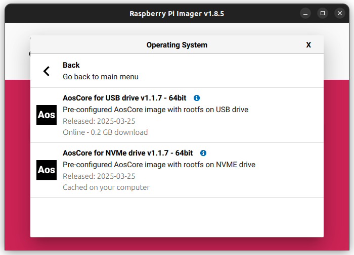
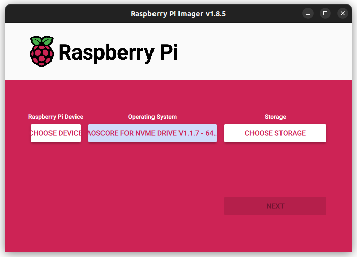
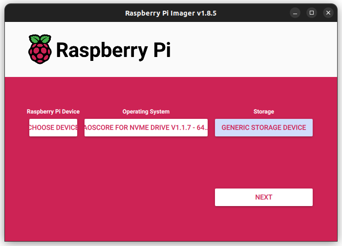

# meta-aos-rpi

This repository contains AodEdge Yocto layers for building AosCore example image for Raspberry 5. Instructions below
cover all necessary steps to use published prebuilt release images of AosCore, if you are interested in building
images yourself, please refer to [Manual build](doc/build.md) or [Build with docker](doc/docker.md) documents.
Note that you still need to secure prerequisites, setup and provision your Raspberry Pi 5 as described in the
corresponding sections below.

## Table of contents

### Install AosCore release image

- [Prerequisites](#prerequisites)
- [Setup Raspberry Pi 5](#setup-raspberry-pi-5)
- [Flash AosCore install image to SD card using Raspberry Pi Imager](#flash-aoscore-install-image-to-sd-card-using-raspberry-pi-imager)
- [Install AosCore image on your device](#install-aoscore-image-on-your-device)
- [Provision device](#provision-device)

## Prerequisites

This demo requires two separate block devices: one contains Raspberry boot partitions and partition for Dom0 while
another block device contains DomD (and possibly other domains) rootfs. The build system builds two separate images
for boot device and rootfs device respectively. In order to run this demo, the following hardware is required:

1. Raspberry Pi 5 board;
2. [Pi UART Debugger](https://www.waveshare.com/wiki/Pi_UART_Debugger), or any other serial console suitable for
   Raspberry Pi 5;
3. SD Card 2GB minimum;
4. One of the following:
   - [Raspberry Pi M.2 HAT+ extension board](https://www.raspberrypi.com/products/m2-hat-plus) with installed
   NVMe drive 16GB minimum (recommended, faster);
   - USB flash drive 16GB minimum.

It is important to ensure that selected either NVMe SSD or Flash USB dirve is clean and **does not contain any boot
images** so that system will boot from SD card. Also make sure to backup the SD card image because the card will be
overwritten during the deployment.

## Setup Raspberry Pi 5

1. Prepare your Raspberry Pi 5 device to be ready to start according to official
[getting started](https://www.raspberrypi.com/documentation/computers/getting-started.html) manual;
2. Depends on selected block device:
   - for the M.2 NVMe drive: assemble Raspberry Pi M.2 HAT+ extension board with NVMe drive according to
     [assembly instruction](https://www.raspberrypi.com/documentation/accessories/m2-hat-plus.html#installation);
   - for the USB flash drive: insert the USB flash drive into available USB 3.0 or USB 2.0 connector on your Raspberry Pi 5
     (depends on your flash drive capability);
3. Connect Pi UART Debugger (or other serial console) and setup your favorite terminal program to work with debug UART
   (see [this instruction](https://www.waveshare.com/wiki/Pi_UART_Debugger) as reference);
4. Connect Raspberry Pi 5 device to your network or host PC with ethernet cable. Your network or host PC should
   configure Raspberry Pi 5 network using DHCP protocol.

## Flash AosCore install image to SD card using Raspberry Pi Imager

1. Download and install [Raspberry Pi Imager](https://www.raspberrypi.com/software);
2. Insert the SD card into a card reader on your host PC;
3. Run Raspberry Pi Imager with `repo` parameter to retrieve the latest AosCore image:

   ```sh
   rpi-imager --repo https://raw.githubusercontent.com/aosedge/meta-aos-rpi/main/os_list.json
   ```

4. Select desired image:

   - click **CHOOSE OS** button:  
      
   - select **AosCore image**:  
      
   - depend on you setup, select image either for NVMe drive **AosCore for NVMe drive** or **AosCore for USB drive**:  
      

5. Select storage:

   - click **CHOOSE STORAGE**:  
      
   - select your SD card device:  
      

6. Flash SD card:

   - press **NEXT** button:  
      
   - confirm flashing SD card device by pressing **YES** on the next dialog box:  
      
   - wait when writing process is finished:  
      
   - remove SD card and press **CONTINUE** button:  
      

## Install AosCore image on your device

1. Insert SD card with AosCore install image into your Raspberry Pi 5 device;
2. Power on the device;
3. Observe AosCore installation progress in your favorite terminal program using debug serial console. Please note
   <ins>this process takes some time</ins> as system unpacks and deploys multiple images on different storages!

   - you should see the following output when installation script is started successfully:

      ```sh
      ********************************************************************************
      Welcome to AosEdge install script!
      ********************************************************************************

      ...
      ```

   - on successful install scrip finish, the following output should appear:

      ```sh
      ...

      ********************************************************************************
      Aos image successfully installed!
      ********************************************************************************
      ```

   - the device will reboot automatically.

## Provision device

1. After installing AosCore image on your device, it should start `Zephyr OS` with AosCore application, see debug
   console output:

   ```sh
   *** Booting Zephyr OS build 4d91cdd6fd3f ***
   *** Aos zephyr application: v1.0.0 ***
   *** Aos core library: v1.0.0 ***
   *** Aos core size: 1991520 ***
   ```

2. Install Aos provisioning script according to [Aos get started](https://docs.aosedge.tech/docs/quick-start/set-up)
   instruction;
3. Obtain Raspberry Pi 5 IP address using your network DHCP server information or by checking the IP address by using
   `ifconfig` command on AosCore `DomD`:

   - once booted, `DOM0` (`Zephyr OS`) console is available:

      ```sh
      (XEN) *** Serial input to DOM0 (type 'CTRL-a' three times to switch input)
      ```

   - press `Ctrl+a` three times (note that it works fine in `cu`, but on `minicom` and maybe other terminals `Ctrl+a`
     overlaps with terminal's own commands, so you need to press it *six* times or you have to release `Ctrl` each time
     or whatever - check your terminal's documentation in case of issues) in a row to enter into `DOM1` (`DomD`) console:

      ```sh
      (XEN) *** Serial input to DOM1 (type 'CTRL-a' three times to switch input)
      ```

      By repeating the sequence above, you are switching between consoles in a loop: `DOM0`, `DOM1`, `Xen` etc.

   - Press `enter` to get a login prompt:
  
      ```sh
      (XEN) main login:
      ```

   - Enter `root` and press `enter`. Now, you should be logged in `DomD`:

      ```sh
      (XEN) root@main:~#
      ```

   - Input `ifconfig` command to get your device IP address (`inet addr`):

      ```sh
      (XEN) root@main:~# ifconfig
      (XEN) eth0      Link encap:Ethernet  HWaddr 2C:CF:67:32:83:CD  
      (XEN)           inet addr:192.168.10.124  Bcast:192.168.10.255  Mask:255.255.255.0
      (XEN)           inet6 addr: fe80::2ecf:67ff:fe32:83cd/64 Scope:Link
      (XEN)           UP BROADCAST RUNNING MULTICAST  MTU:1500  Metric:1
      (XEN)           RX packets:14 errors:0 dropped:0 overruns:0 frame:0
      (XEN)           TX packets:27 errors:0 dropped:0 overruns:0 carrier:0
      (XEN)           collisions:0 txqueuelen:1000 
      (XEN)           RX bytes:1448 (1.4 KiB)  TX bytes:2640 (2.5 KiB)
      (XEN)           Interrupt:86 
      ```

4. Execute provisioning script on your host PC and pass obtained IP address as parameter:

   ```sh
   aos-prov provision -u 192.168.10.124

   ...

   Finished successfully!
   You may find your unit on the cloud here: https://oem.aws-stage.epmp-aos.projects.epam.com/oem/units/33520
   ```

5. Once provisioning is finished successfully, you should see your unit online on `AosCloud` following link provided by
   the provisioning script.
