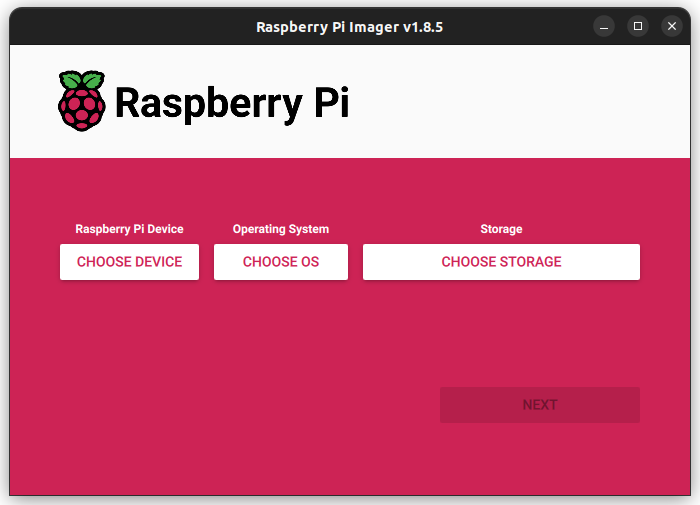
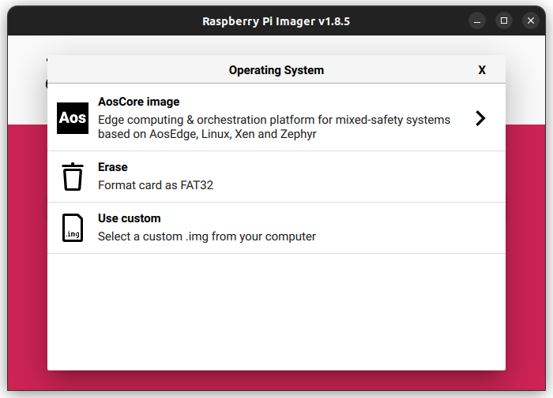
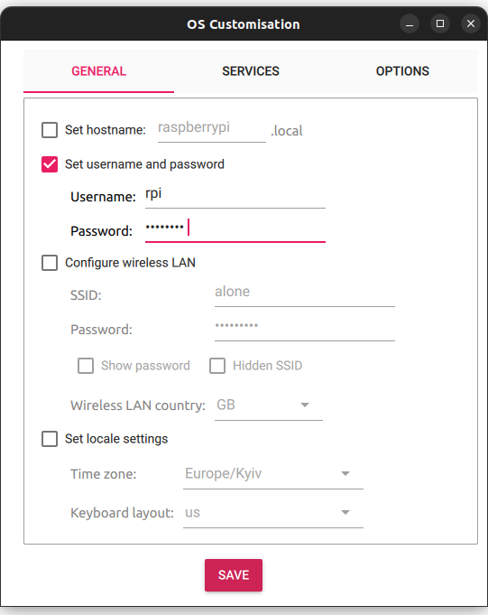
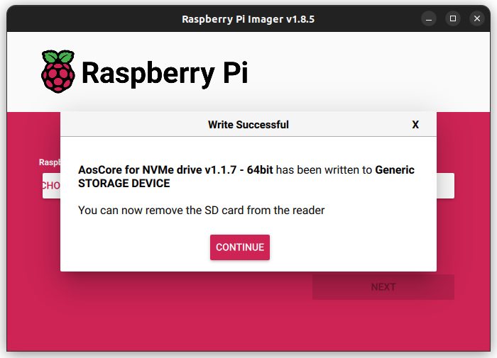

# AosCore Yocto metalayer for Raspberry Pi 5

This repository contains AosEdge Yocto layers for building AosCore example image for Raspberry 5. Instructions below
cover all necessary steps to use published prebuilt release images of AosCore, if you are interested in building
images yourself, please refer to [Manual build](doc/build.md) or [Build with docker](doc/docker.md) documents.
Note that you still need to secure prerequisites, setup and provision your Raspberry Pi 5 as described in the
corresponding sections below.

Some useful info such as remote access, retrieving logs etc. can be found in [troubleshooting](doc/troubleshooting.md)
document.

**NOTE:** This requires user registration on [AosEdge](https://aosedge.tech/), if you are not registered, please
[sign up](https://aosedge.tech/en/sign-up).

## What is inside the image

The image contains a reference system that allows implementation of services orchestration on mixed-safety designs.
To learn more about the approach, please check out [AosEdge documentation](https://docs.aosedge.tech).

### System configuration

The system runs our [Yocto](https://www.yoctoproject.org) based Linux distro and [Zephyr RTOS](https://www.zephyrproject.org)
as guest domains on top of [Xen hypervisor](https://xenproject.org).


Such configuration allows trying orchestration of both traditional Linux containers and unikernels
(e.g. see [Unikraft](https://unikraft.org)) as well as RTOS runtimes in future.

### Hardware assignment

Hardware is split between Zephyr RTOS running in Dom0 and Linux OS running in DomD according to the table below:

| Xen        | Dom0 - Zephyr | DomD - Linux   |
|------------|---------------|----------------|
| Debug UART | UART0         | MIP0           |
|            | SDIO1         | PCIEX          |
|            |               | PCIE1          |
|            | GIC, GPIO2,   | USB0, USB1     |
|            | AXI BUS       | WiFi, ETH      |
|            |               | MSI, PCIE2     |
|            |               | RP1            |

**NOTE:** GPIO and clocks are sitting on RP1, so assigned to the domain where RP1 sits.

For more details and possible changes please refer to [Hardware assignment](doc/hardware.md) document.

## Installing AosCore release image

### Table of contents

- [Hardware prerequisites](#hardware-prerequisites)
- [Setup Raspberry Pi 5](#setup-raspberry-pi-5)
- [Flash AosCore install image to SD card using Raspberry Pi Imager](#flash-aoscore-install-image-to-sd-card-using-raspberry-pi-imager)
- [Install AosCore image on your device](#install-aoscore-image-on-your-device)
- [Provision device with AosCloud](#provision-device-with-aoscloud)

### Hardware prerequisites

This demo requires two separate block devices: one contains Raspberry boot partitions and partition for Dom0 while
another block device contains DomD (and possibly other domains) rootfs. The build system builds two separate images
for boot device and rootfs device respectively. In order to run this demo, the following hardware is required:

1. Raspberry Pi 5 8GB board with a proper power supply. Note that we **require** 8GB version due to the memory mapping.

   **IMPORTANT**: during the installation, system EEPROM will be automatically updated to the latest available official
   version;
2. It is not strictly necessary to have the following parts, but we **strongly recommend** adding:
   - [Pi RTC Battery](https://www.raspberrypi.com/products/rtc-battery/) to avoid issues with AosEdge certificates;
   - [Pi Active Cooler](https://www.raspberrypi.com/products/active-cooler/) so we can put some real CPU load;
3. [Pi UART Debugger](https://www.waveshare.com/wiki/Pi_UART_Debugger), or any other serial console suitable for
   Raspberry Pi 5. Note that we **require** using SH1.0 3PIN UART Debug port to free up GPIO pins;
4. SD Card 2GB or bigger. If unsure, please check out [Raspberry Pi official SD cards](https://www.raspberrypi.com/documentation/accessories/sd-cards.html)
   or [SanDisk Extreme SD cards](https://shop.sandisk.com/en-ua/products/memory-cards/microsd-cards/sandisk-extreme-uhs-i-microsd?sku=SDSQXAF-032G-GN6MA);
5. One of the following:
   - [Raspberry Pi M.2 HAT+ extension board](https://www.raspberrypi.com/products/m2-hat-plus) with installed
   NVMe drive 16GB minimum - this option is **strongly recommended** because it is way faster than USB Flash;
   - USB flash drive 16GB minimum.

   It is important to ensure that the selected NVMe SSD or Flash USB drive is clean and **does not contain any boot
   images** so that system will boot from SD card. Also make sure to back up the SD card image because the card will be
   overwritten during the deployment.

Ensure your PC or laptop has a 1G Ethernet port, a USB-A port, and a micro SD card adapter.
If you do not have those please consider getting a [docking station](https://eu.ugreen.com/products/ugreen-usb-c-7-in-1-hub-with-4k-60hz-hdmi).

### Setup Raspberry Pi 5

1. Prepare your Raspberry Pi 5 device to be ready to start. You can check how to connect power, ethernet SD card and
   other peripherals in the official
   [getting started](https://www.raspberrypi.com/documentation/computers/getting-started.html) manual;
2. Depends on the selected block device:
   - for the M.2 NVMe drive: assemble Raspberry Pi M.2 HAT+ extension board with NVMe drive according to
     [assembly instruction](https://www.raspberrypi.com/documentation/accessories/m2-hat-plus.html#installation).

     **NOTE**: It is not necessary to update Raspberry Pi firmware as stated in the above document as it will be
     automatically updated during installation of AosEdge image;
   - for the USB flash drive: insert the USB flash drive into available USB 3.0 or USB 2.0 connector on your Raspberry
     Pi 5 (depends on your flash drive capability);
3. Connect Pi UART Debugger (or other serial console) and set up your favorite terminal program to work with debug UART
   (see [this instruction](https://www.waveshare.com/wiki/Pi_UART_Debugger) as reference);
4. Connect Raspberry Pi 5 device to your host PC or laptop with an Ethernet cable. To access AosEdge, Raspberry Pi 5
   requires an Internet connection. Ensure your PC or laptop is online and create a bridge between the Ethernet port
   connected to the device and the Internet interface. Instructions for setting up a network bridge are available on the
   Internet, e.g. for
   [Windows](https://www.thewindowsclub.com/create-a-network-bridge-windows), Ubuntu 22.04
   [Linux](https://chrisjhart.com/Bridge-Network-Interfaces-on-Ubuntu-22.04) and
   [MacOS](https://support.apple.com/guide/mac-help/share-internet-connection-mac-network-users-mchlp1540/mac).
   Optionally, you can connect the device to your Ethernet LAN or (for advanced users) use your PC as a router by
   bringing up a DHCP server on the interface connected to the device and setting up IP forwarding between interfaces.

### Flash AosCore install image to SD card using Raspberry Pi Imager

1. Download and install [Raspberry Pi Imager](https://www.raspberrypi.com/software);
2. Insert the SD card into a card reader on your host PC;
3. Run Raspberry Pi Imager with `repo` parameter to retrieve the latest AosCore image:

   ```console
   rpi-imager --repo https://raw.githubusercontent.com/aosedge/meta-aos-rpi/main/os_list.json
   ```

4. Select desired image:

   - click **CHOOSE OS** button:  
      
   - select **AosCore image**:  
      
   - depend on your setup, select image either for NVMe drive **AosCore for NVMe drive** or **AosCore for USB drive**:  
      

5. Select storage:

   - click **CHOOSE STORAGE**:  
      
   - select your SD card device:  
      

6. Flash SD card:

   - press **NEXT** button:  
      
   - сhoose **EDIT SETTINGS** if you wish to set a username and password for logging into the device.
      **ATTENTION:** username and password are required otherwise, you will not be able to log into the Raspberry Pi:  
      
   - navigate to the 'Set username and password' section, select it, and set the username and password
   that will be used to log in to the system on the device. Press **SAVE** to apply the changes:  
      
   - press **YES** button to begin flashing the SD card:  
      
   - wait when writing process is finished:  
      
   - remove SD card and press **CONTINUE** button:  
      

### Install AosCore image on your device

1. Insert SD card with AosCore install image into your Raspberry Pi 5 device;
2. Power on the device;
3. Observe AosCore installation progress in your favorite terminal program using debug serial console. Please note
   <ins>this process takes some time</ins> as system unpacks and deploys multiple images on different storages!

   - you should see the following output when installation script is started successfully:

      ```console
      ********************************************************************************
      Welcome to AosEdge install script!
      ********************************************************************************

      ...
      ```

   - on successful install scrip finish, the following output should appear:

      ```console
      ...

      ********************************************************************************
      Aos image successfully installed!
      ********************************************************************************
      ```

   - the device will reboot automatically.

### Provision device with AosCloud

1. After installing AosCore image on your device, it should start `Zephyr OS` with AosCore application, see debug
   console output:

   ```console
   *** Booting Zephyr OS build 4d91cdd6fd3f ***
   *** Aos zephyr application: v1.0.0 ***
   *** Aos core library: v1.0.0 ***
   *** Aos core size: 1991520 ***
   ```

2. Install Aos provisioning script according to [Aos get started](https://docs.aosedge.tech/docs/quick-start/set-up)
   instruction;
3. Obtain Raspberry Pi 5 IP address using your network DHCP server information or by checking the IP address by using
   `ifconfig` command on AosCore `DomD`:

   - once booted, `DOM0` (`Zephyr OS`) console is available:

      ```console
      (XEN) *** Serial input to DOM0 (type 'CTRL-a' three times to switch input)
      ```

   - press `Ctrl+a` three times (note that it works fine in `cu`, but on `minicom` and maybe other terminals `Ctrl+a`
     overlaps with terminal's own commands, so you need to press it *six* times or you have to release `Ctrl` each time
     or whatever - check your terminal's documentation in case of issues) in a row to enter into `DOM1` (`DomD`)
     console:

      ```console
      (XEN) *** Serial input to DOM1 (type 'CTRL-a' three times to switch input)
      ```

      By repeating the sequence above, you are switching between consoles in a loop: `DOM0`, `DOM1`, `Xen` etc.

   - Press `enter` to get a login prompt:
  
      ```console
      (XEN) main login:
      ```

   - Enter your user name and password that was set during flashing AosEdge install image to SD-Card. Now, you should
     be logged in `DomD`:

      ```console
      (XEN) root@main:~#
      ```

   - Input `ifconfig` command to get your device IP address (see `inet addr`):

      ```console
      (XEN) root@main:~# ifconfig
      (XEN) eth0      Link encap:Ethernet  HWaddr 2C:CF:67:32:83:CD
      (XEN)           inet addr:192.168.10.124  Bcast:192.168.10.255  Mask:255.255.255.0
      (XEN)           inet6 addr: fe80::2ecf:67ff:fe32:83cd/64 Scope:Link
      (XEN)           UP BROADCAST RUNNING MULTICAST  MTU:1500  Metric:1
      (XEN)           RX packets:14 errors:0 dropped:0 overruns:0 frame:0
      (XEN)           TX packets:27 errors:0 dropped:0 overruns:0 carrier:0
      (XEN)           collisions:0 txqueuelen:1000 
      (XEN)           RX bytes:1448 (1.4 KiB)  TX bytes:2640 (2.5 KiB)
      (XEN)           Interrupt:86 
      ```

4. Execute provisioning script on your host PC and pass obtained IP address as parameter:

   ```console
   aos-prov provision -u 192.168.10.124
   ```

5. Once provisioning is finished successfully, you should see your unit online on `AosCloud` following link provided by
   the provisioning script as in example below:

   ```console
   Finished successfully!
   You may find your unit on the cloud here: https://aoscloud.io/oem/units/33520
   ```

6. AosEdge image requires internet connection with the cloud for normal operation. To ensure that internet connection
available on the device, login into `DomD` using serial console as described in
[previous chapter](#provision-device-with-aoscloud). Ping `google.com`:

```console
ping google.com
```
