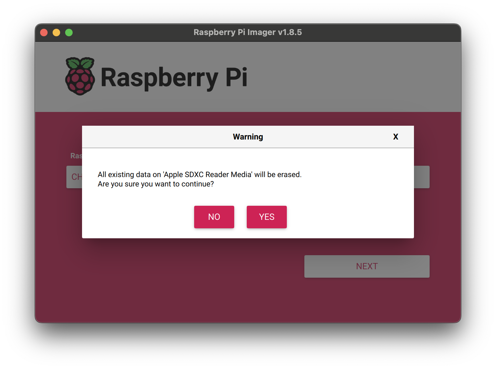

# **Instructions for Preparing Raspberry Pi 5 for Integration with AosEdge**

This guide covers writing the prepared image to an **SD card**, configuring the boot process, and the initial startup of **Raspberry Pi 5**.

---

## **1. Writing the Image to an SD Card**

### **1.1 Download and Install Raspberry Pi Imager**

1. Go to the official **[Raspberry Pi Imager](https://www.raspberrypi.com/software/)** website and download the software for your operating system.

2. Install and launch Raspberry Pi Imager.

### **1.2 Writing the Image to the SD Card**

1. Insert the **SD card** into your computer.

2. In **Raspberry Pi Imager**:

   - Click **"Choose OS"**.
   

   - Click **"AosCore"**.
   

   - Choose **"AosCore for USB drive"** or **"AosCore for NVMe drive"**.
   

   - Click **"Choose Storage"** and select your storage.
   

   - Click **"Next"** → **"Yes"** to start writing the image.
   

   - Wait for the process to complete, then **safely remove** the drive.
   

---

## **2. Assembling Raspberry Pi 5 and Connecting the NVMe SSD**

Follow the official guide for installing the **M.2 HAT+**:  

➡️ **[NVMe HAT+ Installation Guide](https://www.raspberrypi.com/documentation/accessories/m2-hat-plus.html#installation)**

---

## **3. First Boot and System Check**

1. Insert the **SD card** into **Raspberry Pi 5**.

2. Connect **power**.

3. Boot **Raspberry Pi 5** from the **SD card**.

4. Ensure the **system correctly detects connected devices**, including the **NVMe SSD**.

5. Perform any required **initial configurations**.

---

## **4. Integration with AosEdge**

1. After the OS has booted, **perform the necessary configurations** for **AosEdge integration**.

2. Ensure that **all services and components** are functioning correctly.
 
